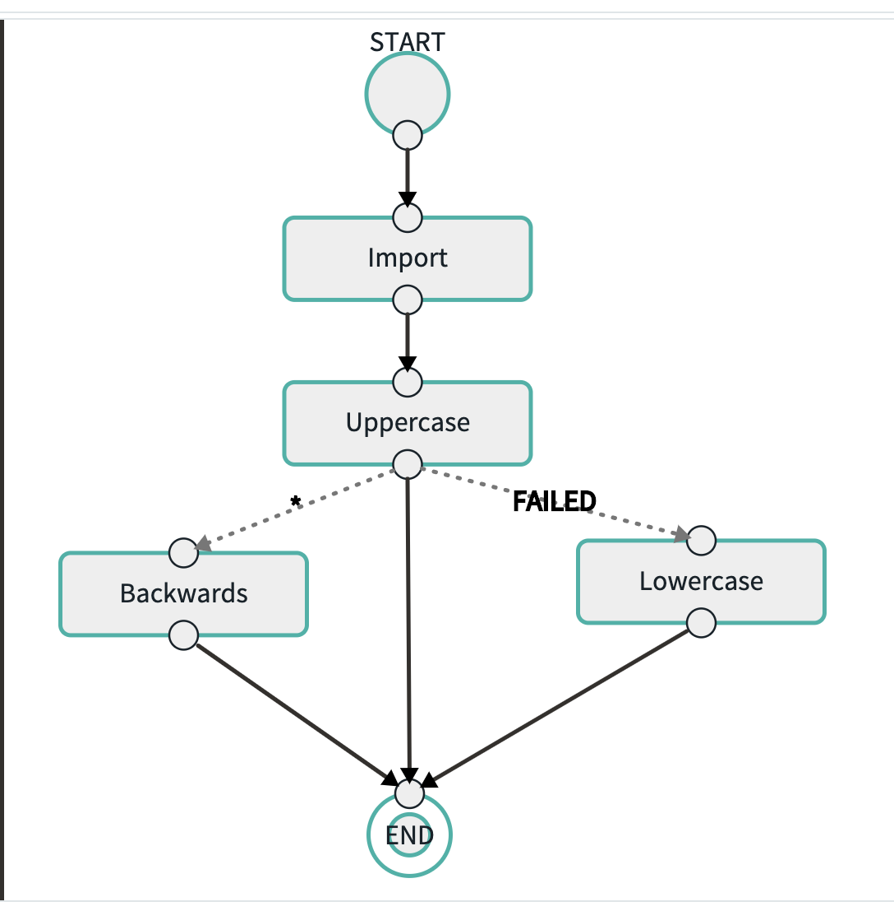

# Spring Batch Demo for Spring Cloud Data Flow

The projects here contain Spring Batch based applications used to demo [Composed Task](https://dataflow.spring.io/docs/batch-developer-guides/batch/data-flow-composed-task/)

## Requirements
- Docker for Desktop 
- Java 1.8+
- Maven
- Database tool to query MySQL to verify results.(Make sure to expose MySQL port locally if using docker)

## Quickstart

Install Docker for your desktop (engine version 18.09.2 or higher)


### Download the code
#### Mac & Linux
```bash
git clone https://github.com/Pivotal-Field-Engineering/spring-cloud-dataflow-samples.git
```

#### Windows
On Windows you might see an error like "filename too long". To fix this, run
```bash
git clone -c core.longpaths=true https://github.com/Pivotal-Field-Engineering/spring-cloud-dataflow-samples.git
```

If you don't have git or git cloning is blocked, try downloading the zip file of the code.

### Start SCDF
From the directory where the docker-compose.yml is saved, run:

#### Mac & Linux
```bash
cd spring-cloud-dataflow-samples/batch
export DATAFLOW_VERSION=2.1.0.RELEASE
export SKIPPER_VERSION=2.0.2.RELEASE
docker-compose up
```
#### Windows
```bash
cd spring-cloud-dataflow-samples/batch
set DATAFLOW_VERSION=2.1.0.RELEASE
set SKIPPER_VERSION=2.0.2.RELEASE
docker-compose up
```

Open http://localhost:9393/dashboard to see the SCDF UI.

#### Help - I don't see any Apps in my SCDF UI!
If your Apps list is empty, then your company firewall is blocking the repo where the starter apps are being downloaded from.

Try downloading the file `scdf-app-repo-0.0.1-SNAPSHOT.jar` from here https://fil.email/V1WtFXIG which is a executable jar file that can be used to import the apps.

```bash
java -jar target/scdf-app-repo-0.0.1-SNAPSHOT.jar
```
This will run a spring boot app that servers up the apps locally that can be used to bulk import starter apps from the SCDF UI.
Navigate to Apps and click on "Add Applications" and select the "Bulk Import Application coordinates from an HTTP URI location"
option. For URI field put in http://host.docker.internal:8080/import

## Connect to MySQL

Connect your favorite MySQL viewer to port 33061 on localhost. **username:**root **password:**rootpw

## Custom Spring Batch Demo Applications

The repo contains the following modules.

- **core:** Contains common code used by the rest of the applications
- **file-ingest:** Spring batch application that reads first name and last name from a given csv file as `filepath` parameter and write to the database table called `Manager_1`. 
- **db-uppercase:** Spring batch application that reads first name and last name from table `Manager_1` table and convert it to uppercase and stores it in table `Manager_2`
- **db-lowercase:** Spring batch application that reads first name and last name from table `Manager_1` table and convert it to lowercase and stores it in table `Manager_2`
- **db-reverse:** Spring batch application that reads first name and last name from table `Manager_2` table and reverses the names and stores it in table `Manager_3`
- **db-delete:** Spring batch application that reads first name and last name from table `Manager_3` table deletes the row

## Build

```bash
mvn clean package

```

## Register the Spring Batch Jobs

Copy the jars to a common directory where SCDF can load them from.

```bash
./copyTaskss.sh 
```

Register the apps in SCDF

### SCDF Shell

We will use the SCDF shell to install our applications. To run:

```bash
./registerApps.sh 
```

## Simple File Ingest

### Register the file-ingest app with SCDF

### Create task
```bash
task create ImportTask --definition "ImportFile: Manager_1"
```

### Run the task
```bash
task launch ImportTask --arguments "--increment-instance-enabled=true"
```

## Uppercase Task after ImportTask

### Create task
```bash
task create UppercaseTask --definition "ImportFile: Manager_1 && Uppercase: Manager_2"
```

### Run the task
```bash
task launch UppercaseTask --arguments "--increment-instance-enabled=true"
```

## Composed Task that demos Distributed Saga Pattern
We will now create a task flow that implements a simple batch Distributed Saga pattern using the above 2 batch applications.

The flow imports a file, converts to UPPERCASE and if that succeeds, it will REVERSE the names. If there is a failure, it will 
convert it back to LOWERCASE undoing the UPPERCASE operation.
   
In this example we only want to undo the UPPERCASE so we are only doing a Compensting Request for that operation.

### Happy Path  
#### Create the Composed Task 
```bash
task create ImportUpperBack --definition "Import: Manager_1 && Uppercase: Manager_2 'COMPLETED'->Reverse: Manager_3 '*'->Lowercase: Comp_Manager_2"
```

This will create a composed task that looks like the following when created using the SCDF UI:


#### Run the task
```bash
task launch ImportUpperBack --arguments "--increment-instance-enabled=true"
```

### Business Failure Path  
#### Create the Composed Task 
```bash
task create ImportUpperBackFail --definition "Import: Manager_1 --file-path=classpath:bf-names.csv && Uppercase: Manager_2 'COMPLETED'->Reverse: Manager_3 '*'->Lowercase: Comp_Manager_2"
```

#### Run the task
```bash
task launch ImportUpperBackFail --arguments "--increment-instance-enabled=true"
```


#Resources

Helpful resources to get some background on this work

##Distributed Sagas

[Distributed Sagas: A Protocol for Coordinating Microservices](https://youtu.be/0UTOLRTwOX0) - Caitie McCaffrey 

